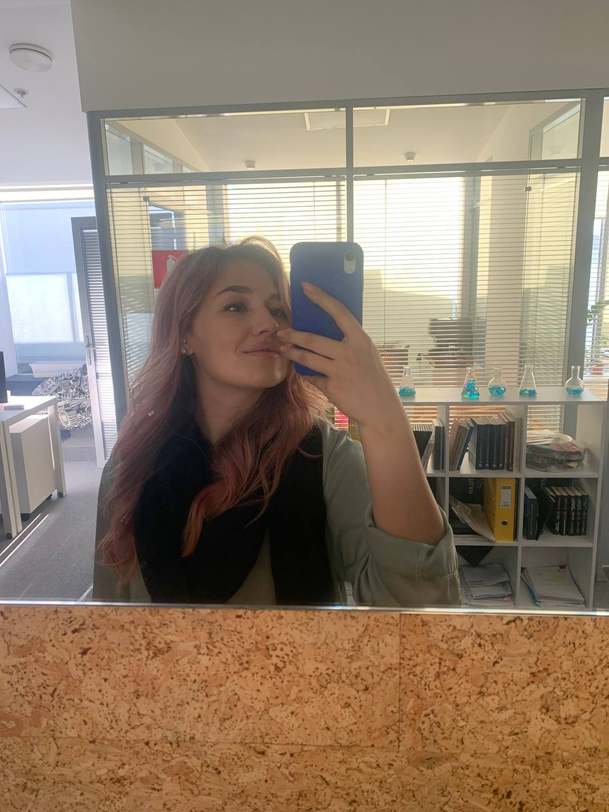
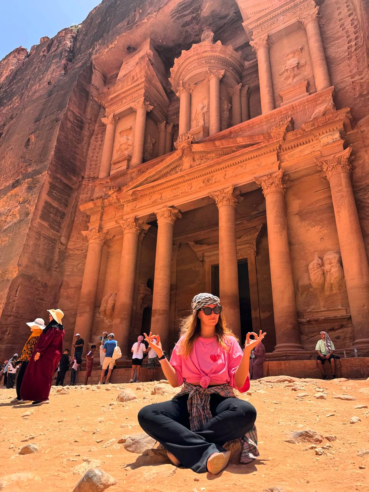

# Обо мне

### Привет! Меня зовут *Настя*.

**"Стараюсь ловить дзен!"** 

Я **инженер-химик-технолог**, работаю в сфере **химического инжиниринга**. 

Занимаюсь разработкой технологий получения продукта *от пробирки до реализации на производстве*. 

*На фото пилотная установка для испытаний*

Это могут быть не только какие-либо химикаты, но и композиты, электролиты, адгезивы, сложные структурные коллоидные соединения, нефтяные продукты, особо чистые вещества. 

**Я родом из города *Находка, Приморского края**. 

**И у нас великолепнейшая природа!**

*На фото мыс Тобизина, г. Владивосток*

Для тех, кто не успел побывать в восточной части РФ продемонстрирую местные пейзажи **для мотивации**!

*На фото бухта Ежовая, г. Находка*